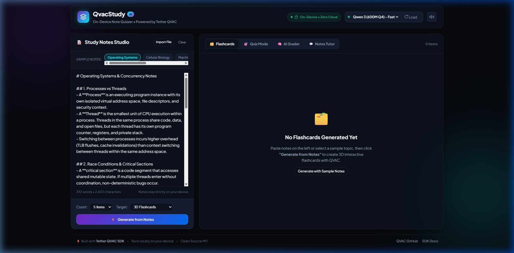

# 🎓 QvacStudy - On-Device AI Note Quizzer & Active-Recall Engine

[](https://opensource.org/licenses/MIT)
[-00f0ff.svg)](https://qvac.tether.io)
[-10b981.svg)](#privacy-first-architecture)
[](https://nodejs.org/)

**QvacStudy** is a private, on-device AI study assistant built with **Tether's open-source [QVAC SDK](https://qvac.tether.io)** (`@qvac/sdk`). It transforms your personal notes, lecture transcripts, and textbook summaries into interactive **3D Flashcards**, **Timed Multiple-Choice Quizzes**, **Active-Recall Answer Assessments**, and an **Interactive AI Study Tutor**—running completely locally on your laptop or phone.

Zero API keys. Zero cloud inference bills. Your private study notes never leave your device.

---

## 📸 Preview



---

## ⚡ Why QvacStudy & Tether QVAC?

| Traditional Cloud Study Apps | QvacStudy (Tether QVAC SDK) |
| :--- | :--- |
| ❌ Sends sensitive lecture/research notes to external cloud APIs | 🔒 **100% Private**: All AI inference runs locally on your CPU/GPU |
| ❌ Requires monthly API subscriptions or recurring token bills | 💰 **Zero Cost**: Free and open-source forever with no API keys |
| ❌ Fails completely without an internet connection | ✈️ **Offline Capable**: Study anywhere, on planes or in remote areas |
| ❌ Unpredictable latency & cloud downtime | ⚡ **Fast & Direct**: On-device Bare runtime engine tuned for local hardware |

---

## 🚀 Key Features

### 1. 🗂️ 3D Interactive Flashcards
- Generates high-yield question-and-answer pairs extracted directly from your study notes.
- Perspective 3D flip card animations (keyboard shortcut: `Space` to flip).
- Spaced-repetition confidence scoring: **Again** 🔴, **Hard** 🟡, **Good** 🔵, and **Easy** 🟢.

### 2. 🎯 Timed Multiple-Choice Quiz
- Dynamic 4-option quiz challenge (A, B, C, D) generated on-device from key facts and definitions.
- Instant right/wrong visual and audio feedback.
- Detailed explanations explaining why each option is correct or incorrect according to your notes.
- Final victory score summary and mastery breakdown.

### 3. 🧠 Active-Recall AI Answer Grader
- Open-ended testing: answer questions in your own words.
- The on-device QVAC model evaluates your answer (0–100%), highlighting **Concepts Nailed** ✅ and **Concepts to Review** 🔍.

### 4. 💬 Ask My Notes (AI Tutor Chat)
- Real-time token-by-token streaming tutor for deep-dive questions on specific concepts.
- Strictly grounded in your notes with zero cloud hallucination.

### 5. 📚 Built-in Preset Note Library
- Instant testing with pre-loaded university-level study sets:
  - **Operating Systems & Concurrency** (Processes, Threads, Mutexes, Coffman Deadlock Conditions, Virtual Memory).
  - **Cellular Biology & Molecular Genetics** (Organelles, Central Dogma, Mitosis vs Meiosis).
  - **Machine Learning Foundations** (Supervised/Unsupervised, Gradient Descent, Bias-Variance, Regularization).
  - **The Industrial Revolution** (Origins, Steam Power, Factory System, Social Impacts).

### 6. 💻 Terminal CLI Mode
- Prefer working in the terminal? Run `node cli.js --notes ./path/to/notes.md` to take active-recall quizzes straight from your shell!

---

## 🛠️ Architecture & QVAC SDK Integration

QvacStudy is powered by Tether's `@qvac/sdk` (>=0.19.0) native runtime.

```
┌─────────────────────────────────────────────────────────────┐
│                       Browser UI                            │
│  (3D Flashcards • Multi-Choice Quiz • AI Grader • Tutor)    │
└──────────────────────────────┬──────────────────────────────┘
                               │  REST & SSE Events (localhost:3000)
┌──────────────────────────────▼──────────────────────────────┐
│                    Node.js Local Server                     │
│  (src/server.js & src/engine/qvacService.js)                │
└──────────────────────────────┬──────────────────────────────┘
                               │  @qvac/sdk API
┌──────────────────────────────▼──────────────────────────────┐
│                      Tether QVAC SDK                        │
│  • loadModel()       -> Downloads & mounts local GGUF       │
│  • completion()      -> On-device token streaming           │
│  • ragIngest/Search  -> Local vector embeddings & retrieval │
│  • unloadModel()     -> Cleans RAM / system memory          │
└──────────────────────────────┬──────────────────────────────┘
                               │  Bare Worker RPC
┌──────────────────────────────▼──────────────────────────────┐
│             Local Bare / C++ Inference Engine               │
│  (QWEN3_600M_INST_Q4 / LLAMA_3_2_1B_INST_Q4_0 / GTE_LARGE)   │
└─────────────────────────────────────────────────────────────┘
```

---

## 📦 Quickstart & Installation

### Prerequisites
- **Node.js**: v18.0.0 or newer (tested on Node v20, v22, and v24 on Windows, macOS, and Linux).
- **Git**

### 1. Clone the repository
```bash
git clone https://github.com/your-username/qvac-study-ai.git
cd qvac-study-ai
```

### 2. Install dependencies
```bash
npm install
```
This installs `@qvac/sdk` (^0.19.1) alongside `express` and `cors`.

### 3. Launch the Web Application
```bash
npm start
```
Open **[http://localhost:3000](http://localhost:3000)** in your browser!

### 4. Or Run in Terminal CLI Mode
```bash
# Quiz from sample notes:
npm run cli

# Or quiz from your own file:
node cli.js --notes ./sample_notes.md
```

---

## 🧪 Automated Tests

Run the verification test suite:
```bash
npm test
```
The test suite verifies:
1. Package dependencies (`@qvac/sdk` >= 0.19.0).
2. QVAC SDK exported functions (`loadModel`, `completion`, `unloadModel`, `ragIngest`, `ragSearch`).
3. Sample notes integrity.
4. JSON extraction utilities for structured quiz outputs.
5. Service status reporting schema.

---

## 📝 Tether Submission Checklist

- [x] **App Built & Working**: Runs on-device AI with Tether's QVAC SDK.
- [x] **Declared Dependency**: `@qvac/sdk` in `package.json` on version `^0.19.1` (>=0.19.0).
- [x] **Required SDK Functions Called**: Calls `loadModel`, `completion`, `unloadModel`, and `ragIngest` / `ragSearch`.
- [x] **100% On-Device Inference**: No cloud AI APIs used.
- [x] **Public Open-Source Repo**: Includes MIT License and full README documentation.
- [x] **Screenshot Captured**: Saved in `docs/screenshot.png`.

---

## 🐦 Post on X Template

When sharing your project on X (Twitter):

> Built an on-device AI study app with @qvac by @Tether_to! 🎓⚡
>
> QvacStudy turns your personal lecture notes into 3D flashcards, active-recall quizzes, and AI tutor feedback directly on your laptop—100% private with zero API keys or cloud bills.
>
> 🔗 Repo: https://github.com/your-username/qvac-study-ai
> 
> #QVAC #LocalAI #OpenSource #OnDeviceAI #EdTech

---

## 📄 License

Distributed under the **MIT License**. See [`LICENSE`](LICENSE) for details.
